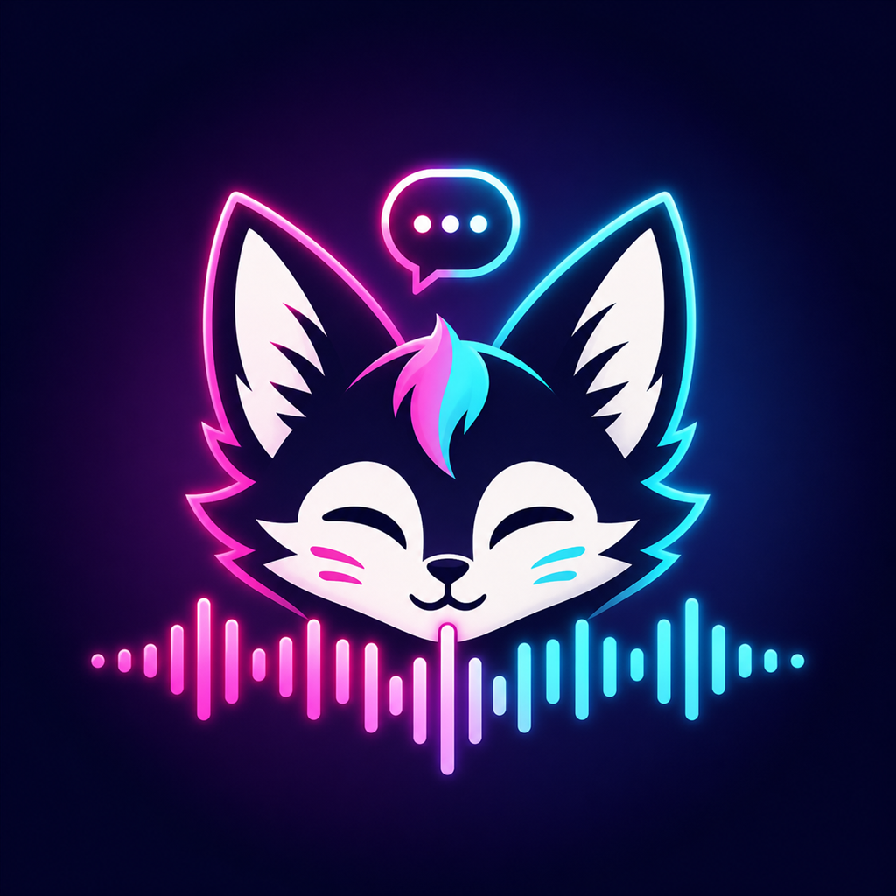

# NekoSuneAPPS — Features & Safety

A complete list of what **NekoSuneAPPS** does, how your data is handled, and the
important "use at your own risk" notes. **Short version: everything runs on your own
PC, we collect nothing, and the app never injects code into VRChat or any other
program.**

---

## ✨ Features

### VRChat
- **Chatbox** — type to the in-game chatbox, plus an auto-rotating composer that cycles
  live data lines.
- **Status presets** — templated lines with `{tokens}` (time, song, cpu, gpu, ram, hr,
  net, followers, window, `{weather}`, `{players}`, …).
- **AudioLink** — Low/Bass/Mid/Treble audio spectrum sent over OSC as custom avatar
  parameters (see [Avatar parameters](#-audiolink-avatar-parameters) below).
- **Now Playing** — reads your Windows media session; supports KAT and chatbox posting.
- **Discord Rich Presence** — shows your VRChat **world**, **❤️ heart rate** and **🎵 now
  playing**, with a one-click **Join World** button and a **VRChat Profile** button.
  A privacy gate hides your world unless your status is 🟢 Join Me / 🔵 Active.
- **VRChat auto-status** — optional VRChat account login reads your live status
  (🟢/🔵/🟠/🔴) and applies it automatically.
- **Radar** — live list of players in your current instance.
- **Weather** — current conditions for a city you pick (`{weather}` token).
- **SpotiOSC** — control Spotify (play/pause/next/previous/stop) from VRChat avatar params.
- **DiscordOSC** — mute / deafen yourself from VRChat avatar params (via the bot).
- **VRChat Tools** — external, file-based maintenance (inspired by VRCNext, no game
  injection): **YouTube fix** (updates `yt-dlp` so world video players work), **cache
  size / clear**, and quick **open-folder** shortcuts.
- **VR gear battery** — extension point for HMD/controller battery.
- **OBS overlay** — a now-playing browser source.

### Heart rate
- **Pulsoid** and **HypeRate.io** providers (live BPM, avg/min/max).
- **Session history** — past sessions saved locally (duration, avg, min, max).

### Live / streaming
- **TikTok**, **Twitch**, **Kick** follower & live counters.
- **TikTok TTS** via gesserit.co.

### Integrations & tools
- **Discord Voice Bot** — your own bot (invisible/offline) reads voice state and can
  server-mute/deafen you over OSC. The supported alternative to Discord's allowlist-only
  voice scope.
- **Soundpad** — trigger Leppsoft Soundpad sounds.
- **IntelliChat** — AI rewrite / spellcheck / shorten / translate (OpenAI-compatible).
- **Component / Network stats**, **Window activity**.
- **Stopwatch**, **Calculator**, **Auto-AFK** (idle detection + custom message).
- **Startup** — launch on login, start minimized, per-feature auto-start.

---

## 🔊 AudioLink avatar parameters

NekoSuneAPPS analyzes your audio output into 4 bands and sends them to VRChat over OSC
(`127.0.0.1:9000`) every audio frame as **custom avatar parameters**. To react to them,
add each one to your avatar's **Expression Parameters** and **Animator Controller**. The
avatar parameter name is the part after `/avatar/parameters/`.

| Parameter (exact, case-sensitive) | Type | Range | Meaning |
| --- | --- | --- | --- |
| `VRCOSC/NekoSuneApps/Audiolink/Low` | Float | 0.0 – 0.92 | Band 0 level |
| `VRCOSC/NekoSuneApps/Audiolink/Bass` | Float | 0.0 – 0.92 | Band 1 level |
| `VRCOSC/NekoSuneApps/Audiolink/Mid` | Float | 0.0 – 0.92 | Band 2 level |
| `VRCOSC/NekoSuneApps/Audiolink/Treble` | Float | 0.0 – 0.92 | Band 3 level |
| `VRCOSC/NekoSuneApps/Audiolink/Volume` | Float | 0.0 – 0.92 | Average of the 4 bands |
| `VRCOSC/NekoSuneApps/Audiolink/Peak` | Float | 0.0 – 0.92 | Max of the 4 bands |
| `VRCOSC/NekoSuneApps/Audiolink/Beat` | Bool | 0 / 1 | `true` while Peak > 0.65 |

Notes:

- **Max value is 0.92, not 1.0** — output is clamped, so map your animations to a
  `0 → 0.92` range.
- `Beat` is sent as a float `1.0`/`0.0`; define it as **Bool** (VRChat coerces it) or
  Float if you want to fade.
- `/` is allowed in VRChat parameter names — type the names exactly.
- Mark the params **synced** if other players should see the reaction (≈49 bits total),
  or leave them **local** to save parameter memory — OSC drives them on your client either
  way.
- Enable OSC in VRChat: **Radial Menu → Options → OSC → Enabled**. The app's OSC-out port
  must match VRChat's listen port (default **9000**).

---

## 🔒 How safe is it?

### We collect nothing
NekoSuneAPPS has **no backend, no analytics, no telemetry, and no accounts**. The
developers never receive any information about you or your usage. There is nothing to
sell or share — and we don't.

### Everything is local
All settings — tokens, API keys, your VRChat **session cookie**, Discord **bot token**,
usernames, presets, heart-rate history — are stored **only on your own computer** in the
OS per-user app-data folder. They leave your machine **only** to talk directly to the
service they belong to (e.g. your Pulsoid token goes only to Pulsoid).

### Your VRChat password is never stored
When you use VRChat auto-status, the app logs in once and keeps only the **session
cookie** VRChat returns. Your password is **not** saved.

### No code injection, no game modification
**NekoSuneAPPS does not modify, inject code into, hook, patch, or tamper with VRChat or
any other application or software.** It only uses official, supported interfaces:

- VRChat's own **OSC** protocol (local UDP),
- official / public **APIs** using credentials **you** supply,
- **reading log files that VRChat itself writes** (for world + radar),
- standard **OS media keys** (for SpotiOSC).

There are no memory edits, no DLL injection, no mods, and no automation of the game
client itself.

---

## ⚠️ Use at your own risk (Terms)

- Some platforms **rate-limit or prohibit automated access**. **Sending too many requests
  is at your own risk** and could lead to rate-limiting or account action.
- **NekoSuneAPPS is not responsible for any account bans, suspensions, or data loss.**
  Because the app does not inject code or modify VRChat (or any other app/software), it
  does not itself break those platforms — but how *you* use third-party APIs is your
  responsibility.
- **Always follow the Terms of Service** of every platform/app you connect to (VRChat,
  Discord, Twitch, TikTok, Kick, Pulsoid, HypeRate, Spotify, Soundpad, your AI provider,
  etc.).
- **Do not** use the app for anything **illegal, criminal, harmful, or damaging**. Provide
  only credentials you are authorized to use.

See [DISCLAIMER.md](DISCLAIMER.md), [TOS.md](TOS.md), and [PRIVACY.md](PRIVACY.md) for the
full text.

---

## 💡 Requests

Want a feature added? **Open an issue** on the project's GitHub Issues page:
<https://github.com/NekoSuneProjects/NekoSuneOSC/issues>

NekoSuneAPPS is an independent project and is **not affiliated with** VRChat, Discord,
Spotify, Leppsoft, Pulsoid, HypeRate, or any other third party. All trademarks belong to
their respective owners.
