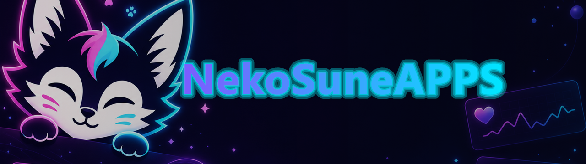

# NekoSuneAPPS 🦊💬

[](#contributors)

A standalone **VRChat OSC companion** by **NekoSuneVR** — chatbox, heart rate, now
playing, Discord, world radar & more, in one polished themed app.

> Chatbox · Status · AudioLink · Now Playing (KAT) · Component & Network stats ·
> Heart rate (Pulsoid / HypeRate / local device bridge) · Avatar Locker · TikTok / Twitch / Kick counters · TikTok TTS ·
> IntelliChat · Discord Rich Presence (world + Join button) · Discord Voice Bot ·
> VRChat auto-status · Radar · Weather · OSCQR · SpotiOSC · DiscordOSC · ShazamOSC · Soundpad ·
> Stopwatch · Calculator · Auto-AFK · OBS overlay.

---

## ✨ Features

| Module | What it does | Needs |
| --- | --- | --- |
| **Live Typing** | Sends chatbox text while you type, with optional translate-before-send | VRChat OSC; optional translator |
| **Translation & Speech** | Translator settings, TikTok TTS, hosted/custom LibreTranslate, DeepL, Google, MyMemory, and STT/TTS roadmap | optional provider endpoint/API key |
| **Multi-client OSC** | Mirror outgoing OSC to extra VRChat clients and listen on extra receive ports | extra VRChat OSC ports |
| **Avatar Scaling** | VRChat native OSC height scaling from `0.01` to `10000.00`, with global hotkeys | VRChat OSC |
| **Avatar Search Providers** | Built-in VRCX-style avatar search providers plus custom endpoint support | external avatar search endpoint |
| **Localization** | App language picker and locale foundation with English fallback | ongoing translation coverage |
| 💬 **Chatbox** | Type to VRChat + auto-rotate live data lines | — |
| 📝 **Status presets** | Templated lines with `{tokens}` | — |
| 🔊 **AudioLink** | Low/Bass/Mid/Treble spectrum over OSC | audio output device |
| 🎵 **Now Playing** | Windows media + KAT + chatbox posting, with timestamp/progress tokens and custom text bars | Windows |
| 🎬 **TikTok followers** | Live followers / viewers / new follows | creator must be **live** |
| 🟣 **Twitch followers** | Follower total (Helix) | Client ID + OAuth token |
| 🔑 **OAuth Accounts** | Shared provider applications, redirects and tokens | your provider app credentials |
| 🟢 **Kick followers** | Follower total + live state | channel slug |
| 🗣 **TikTok TTS** | Voice synthesis via gesserit.co | — |
| ✨ **IntelliChat** | AI rewrite/spellcheck/shorten/translate | OpenAI-compatible key |
| 🖥 **Component stats** | CPU/GPU/RAM load & temps | — |
| 🌐 **Network stats** | Up/down + ping | — |
| 🪟 **Window activity** | Active app/window title | — |
| ❤️ **Heart rate** | Live BPM + session history; generic local input for unsupported devices | **Pulsoid** token, **HypeRate** key, or a local bridge |
| 🔐 **Avatar Locker** | Verify signed ownership packages and send avatar feature locks over OSC | A signed `.nalown` package |
| 🔌 **OSC Apps** | Native OSCQR, DiscordOSC, SpotiOSC, Twitch interactions, song recognition, Realistic Leash, Rusk Laserdome, and Digital Clock | OSC receive; optional Twitch, Discord Bot, or recognition credentials |
| 💜 **Discord Rich Presence** | World + ❤️ BPM + 🎵 song, with a **Join World** button | Discord App ID |
| 🤖 **Discord Voice Bot** | Read voice state + server mute/deafen via OSC (no allowlist) | your own bot token |
| 🦊 **VRChat auto-status** | Detect 🟢/🔵/🟠/🔴 from your account | VRChat login (2FA ok) |
| 🫂 **Social suite** | Friends, groups, search, profiles, favourites, notifications, **create group instances**, **bio prefabs** | VRChat login |
| 🧰 **VRChat tools** | YouTube fix (yt-dlp), **VRCVideoCacher** install/run, cache tools | Windows |
| 📡 **Radar** | Live list of players in your instance | reads VRChat log |
| 🌦 **Weather** | Current conditions as `{weather}` | a city (Open-Meteo, no key) |
| 🔊 **Soundpad** | Trigger Leppsoft Soundpad sounds | Soundpad running |
| ⏱ **Stopwatch / 🧮 Calculator / 💤 Auto-AFK** | Handy tools, post to chatbox | — |
| 🔋 **VR gear battery** | HMD/controller battery | native OpenVR helper (see below) |
| 🖥 **OBS overlay** | Now-playing browser source | — |

---

## 🚀 Quick start

```bash
cd "D:/DEV/NekoSuneVRAPPS/VRChatStuff/NekoSuneOSC"
npm install
npm start
```

In VRChat, enable **OSC** (Action Menu → Options → OSC → Enabled). NekoSuneAPPS sends
to `127.0.0.1:9000` and can receive on `9001` (configurable in **Settings** — receive
must be **on** for KAT, SpotiOSC and DiscordOSC).

For multiple VRChat clients, add optional extra ports in **Settings -> OSC**. Example:
primary VRChat `9000`/`9001`, second VRChat `9002`/`9003`; add `127.0.0.1:9002` as an
extra send target and `9003` as an extra receive port.

The sidebar is grouped into **VRChat**, **Tools**, and **General**.

### Recent integrations

- **Live Typing** sends chatbox text as you type and can translate before sending.
- **Translator** supports LibreTranslate, DeepL, and Google Translate provider settings.
- **Avatar Scaling** uses VRChat's native OSC height-scaling params and supports precise
  values from `0.01` to `10000.00`, plus optional global hotkeys.
- **Localization** adds an app language picker and locale files with English fallback.
- **Multiple VRChat clients** can be targeted from **Settings -> OSC**. Keep the first
  client on `9000`/`9001`; if a second client uses `9002`/`9003`, add
  `127.0.0.1:9002` under extra send targets and `9003` under extra receive ports.
  Outgoing chatbox, params, AudioLink, KAT text, DiscordOSC, and Avatar Scaling
  messages are mirrored to extra send ports. OSC listeners can also hear the extra
  receive ports while receive is enabled or another feature is listening.
- **Now Playing status tokens** include source, elapsed time, duration, and `{songbar}`;
  the text progress bar can be styled as bars, stars, diamonds, dots, squares, or thin blocks.

---

## 🔑 Getting tokens & accounts

- **Pulsoid**: token at [pulsoid.net keys](https://pulsoid.net/ui/keys) with `data:heart_rate:read`.
  The Heart Rate page uses Pulsoid's redirect-free Device Authorization Flow for
  `data:heart_rate:read` only. Device posting uses a separate manually issued token
  with `data:heart_rate:write`; the two token fields are never copied or combined.
  The app client ID and read scope are configured in
  `modules/heartrate/providers/pulsoid/pulsoid.config.json`.
- **HypeRate**: request an API key from HypeRate, then enter it + your `hyperate.io/<id>` device ID.
- **Unsupported devices**: select **Other device / local bridge**, start the receiver,
  then send JSON such as `{"bpm":72}` to `http://127.0.0.1:7392/heart-rate`.
  Pulsoid-compatible `{"data":{"heart_rate":72}}` payloads and `?bpm=72` requests
  also work. Enable **Also feed readings to Pulsoid** and use a token with
  `data:heart_rate:write` if you want the same readings available in Pulsoid.
- **Bluetooth LE devices**: under **Other device / local bridge**, use **Scan nearby**
  to discover watches and monitors or **Paired / remembered** to reload devices
  previously granted to NekoSuneAPPS. Devices implementing the standard BLE Heart
  Rate Service connect directly. **GMANS WATCH** is also supported through its built-in
  proprietary protocol adapter; other proprietary watches require their own adapter.
  The last watch is cached in AppData and automatically reconnects while the app is on
  another page or hidden in the tray. A 45-second no-reading watchdog restarts stale
  GATT sessions, while live GMANS optical frames keep a measuring session alive even
  before BPM is available. Use **BLE debug log** for local scan/connect/frame diagnostics.
    An experimental screen-off handshake replay is available but disabled by default:
    captures show that its payload changes between sessions, so it is not a reliable
    substitute for opening the watch's Heart Rate screen. For GMANS firmware, enable
    **watch-side automatic heart rate** instead; this uses the official app's scheduling
    command and works with the watch screen closed. Automatic samples may be periodic or
    stored for history rather than streamed continuously.
- **Beko Smooth Heartbeat 3.x / VRC Heart Rate**: leave its OSC profile enabled and the
  app sends `VRCOSC/Heartrate/Value` plus connection, average, beat, normalized and digit
  fields from any selected provider. Only enable the legacy `HR` option for a 2.x avatar.
- **Akaryu HeartRate OSC 3.0**: sends `hr_percent`, `hr_connected`, and `hr_beat`; its
  maximum BPM is configurable and defaults to the original `hr-osc` value of 200.
- **VRChat account** (auto-status / Radar): log in on the **VRChat** tab. Handles email &
  authenticator 2FA. Your **password is never stored** — only the session cookie, locally.
- **Discord (Rich Presence)**: an Application (Client) ID from the
  [Discord Developer Portal](https://discord.com/developers/applications). A default ID is preset.
- **Discord (Voice Bot)**: create a **bot**, copy its **token**, use the in-app **Invite link**
  to add it to **your own private server**, and enter your Discord **user ID**. It stays invisible.
- **ShazamOSC song recognition**: enter your own token from the
  [AudD dashboard](https://dashboard.audd.io/). Audio is captured only from the screen/system
  audio source you explicitly share, then a short clip is sent to the selected provider.
  ACRCloud is also available with a project host, access key and access secret. Automatic
  mode tries configured providers in order; optional GPL `node-shazam` is detected but
  never bundled by NekoSuneAPPS.
- **TikTok**: enter the creator's `@username` while they are **live** (add a free
  [Euler Stream](https://www.eulerstream.com) key if you hit `SignatureError`).
- **Twitch**: Client ID from the [Twitch Dev Console](https://dev.twitch.tv/console), then
  authorize it once from **OAuth Accounts**. It requests `moderator:read:followers`, `chat:read`, and
  `channel:read:redemptions` for counters and Twitch Interactive.
- **Kick**: your channel slug (after `kick.com/`).
- **OpenAI / compatible**: an API key from your provider.
- **Translator**: choose LibreTranslate, DeepL, or Google Translate in Settings.
  LibreTranslate needs your own `/translate` endpoint; DeepL and Google need API keys.
  Live Typing can translate text before sending it to the VRChat chatbox.

---

## 🎛 OSC control parameters

Enable **OSC receive** in Settings, then drive these VRChat **avatar parameters** (bool):

```
SpotiOSC   /avatar/parameters/VRCOSC/Spotify/PlayPause   (also /Next /Previous /Stop)
Media      /avatar/parameters/VRCOSC/Media/Play          (also /Skip /Next /Previous)
DiscordOSC /avatar/parameters/VRCOSC/Discord/Mic         (also /Mute /Deafen)
Clock      /avatar/parameters/VRCOSC/Clock/Hours         (also /Minutes, Float 0–1)
Date/time  /avatar/parameters/DateTimeHour               (also Minute /Day /Month, Int)
OSCQR      /avatar/parameters/OSCQR/StartRecording       (also ReadQRCode; outputs QRCodeFound/Error)
ShazamOSC  /avatar/parameters/ShazamOSC/Recognize        (also LiveListening; outputs Recognized/Listening/Error/OSCTrackID/BassLevel)
```

When DiscordOSC is enabled, the app also publishes
`VRCOSC/Metadata/Modules/YUCP.VIRA.yeusepesmodules.discordosc` as a Bool.
OSCQR, SpotiOSC, and ShazamOSC publish equivalent lowercase module metadata flags.

---

## 🏗 Architecture

```
NekoSuneAPPS/
├─ main.js            # Electron main — owns all network/native modules + IPC
├─ preload.js         # IPC bridge (window.electronAPI)
├─ renderer.js        # UI logic, chatbox composer wiring
├─ index.html         # themed tabbed UI (CSS-variable theme engine)
├─ settings.js        # electron-store persistence
└─ modules/
   ├─ vrchat/         # VRChat-specific
   │  ├─ osc/         # OSC + KAT, media keys (SpotiOSC)
   │  ├─ chatbox/     # chatboxComposer — merges + rotates sources
   │  ├─ status/      # presets + token resolver
   │  ├─ audio/       # AudioLink spectrum
   │  ├─ world/       # world + radar (log tailer)
   │  ├─ api/         # VRChat API (auto status)
   │  └─ vr/          # vrBattery (extension point)
   ├─ heartrate/      # providers, BLE/device bridges, analytics and OSC profiles
   ├─ weather/        # Open-Meteo
   ├─ integrations/   # grouped external/service integrations (see its README)
   │  ├─ osc/         # QR, recognition, clocks, leashes and Laserdome
   │  ├─ ton/         # all ToN modules, data, saves and tonOsc
   │  ├─ discord/     # Rich Presence, RPC and DiscordOSC bot
   │  ├─ media/       # Soundpad and Photo Relay
   │  └─ maintenance/ # updater and Windows notifications
   ├─ oauth/          # shared OAuth provider implementations
   ├─ live/           # TikTok, Kick, TTS and consolidated Twitch runtime features
   ├─ media/ stats/ activity/ ai/ overlay/
```

Network/native code runs in the **main process** and streams updates to the renderer
via `mainWindow.webContents.send(...)`; the renderer subscribes with
`electronAPI.on('<channel>', cb)`.

---

## 🔋 VR gear battery (extension point)

VR battery is read through the native OpenVR runtime (`openvr_api.dll`). There is no
well-maintained pure-Node OpenVR binding, so `modules/vrchat/vr/vrBattery.js` currently
reports *unavailable*. To make it real, ship a small native helper (C#/C++ using OpenVR)
that prints device-battery JSON and spawn it from that module.

---

## 📦 Building installers

```bash
npm run build:win              # Windows nsis + msi
npx electron-builder --linux   # AppImage + deb
npx electron-builder --mac     # dmg + zip (run on macOS)
```

CI builds all three OSes on every push via
[`.github/workflows/build.yml`](.github/workflows/build.yml). Pushing a `vX.Y.Z` tag also
publishes a GitHub Release with the installers attached. The app ships **no native
node-gyp modules**, so Windows/macOS/Linux all build without a C++/Python toolchain
(window-activity uses the OS's own CLI: PowerShell / `osascript` / `xdotool`).

---

## Contributors

<!-- ALL-CONTRIBUTORS-LIST:START - Do not remove or modify this section -->
<!-- prettier-ignore-start -->
<!-- markdownlint-disable -->

<!-- markdownlint-restore -->
<!-- prettier-ignore-end -->

<!-- ALL-CONTRIBUTORS-LIST:END -->

---

## 📜 License & policies

**Source-available contribution license — All Rights Reserved.** © 2024–2026 NekoSuneVR.
You may run official unmodified releases for personal use, and you may fork and modify
the code only to prepare fixes, features, integrations, documentation updates, or removal
proposals for submission back to the official repository. You may **not** redistribute
modified builds, reuse the code in other projects, inject code into VRChat, add malware,
or use the code/assets/docs/issues/pull requests/contributions to train AI. See
[LICENSE](LICENSE), [CONTRIBUTING.md](CONTRIBUTING.md), [TOS.md](TOS.md),
[PRIVACY.md](PRIVACY.md), and [DISCLAIMER.md](DISCLAIMER.md). Version history is in
[CHANGELOG.md](CHANGELOG.md).
